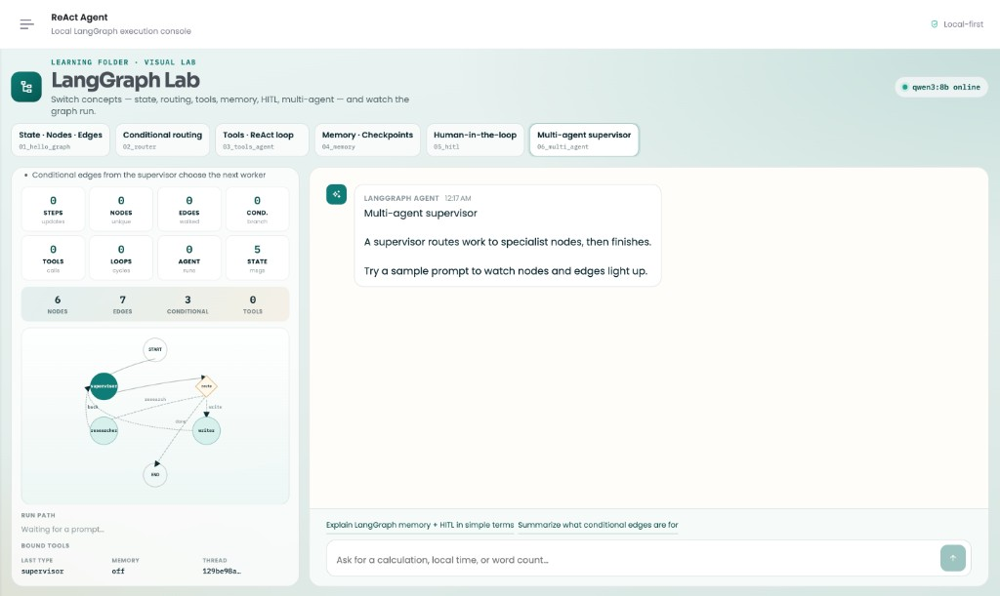
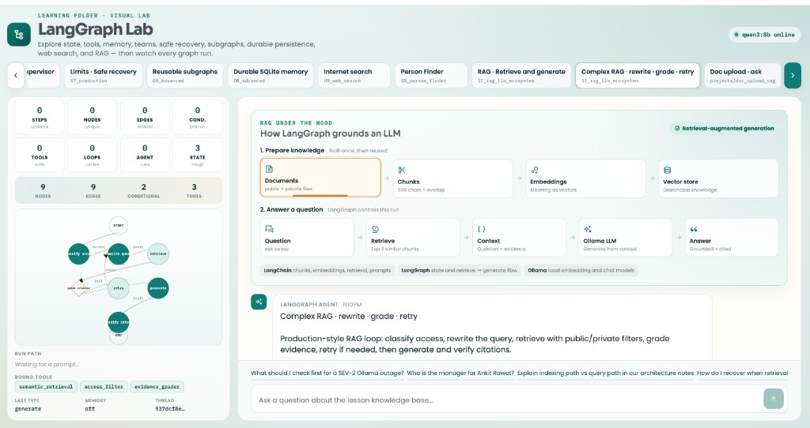
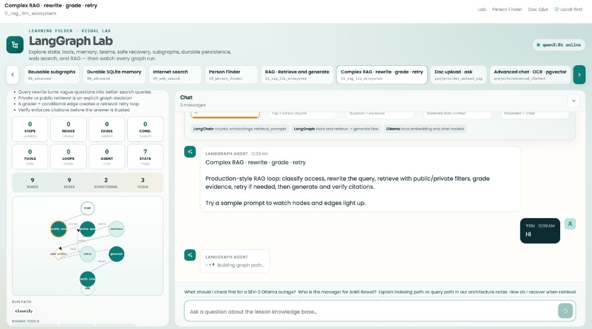

# Learning LangGraph — Beginner → Advanced → Real Projects

A hands-on path to understand **why LangGraph exists**, how it helps in **today’s AI work**, and how to grow from a first graph to **complex, production-style systems**.

This repo keeps lessons in `Learning/` only. Later you can add your own real project beside it in the same folder.








---

## Why LangGraph? (for beginners)

A normal chat LLM answers one prompt at a time. Real products need more:

| Real need | Plain LLM chat | LangGraph |
|-----------|----------------|-----------|
| Multi-step work | Hard to control | Nodes + edges = clear steps |
| Use tools (calc, APIs, DB) | Ad-hoc / brittle | Tool nodes + loops |
| Remember past turns | Easy to lose context | Checkpointers + `thread_id` |
| Ask a human before risky actions | Manual hacks | HITL interrupts / resume |
| Many specialists (research, write, review) | One messy prompt | Multi-agent supervisor graphs |
| Debug “what happened?” | Black box | State, path, and stream updates |

**Simple mental model**

```text
START → node (do work) → maybe branch → maybe loop → END
         ↑______________________________|
              shared state (memory)
```

LangGraph is a **stateful workflow engine for LLM apps**: you define *state*, *nodes* (functions), and *edges* (what runs next). The LLM is one worker inside a graph you can see, test, and control.

---

## How this helps in today’s work

Modern AI jobs rarely stop at “call ChatGPT once.” Teams ship agents that:

1. **Route** a ticket (billing vs tech vs general)
2. **Call tools** (CRM, search, calculator, email)
3. **Keep memory** across a user session
4. **Pause for approval** before sending money / emails / deletes
5. **Split work** across researcher / writer / reviewer agents
6. **Stream progress** to a UI so users trust the system

LangGraph maps cleanly to those jobs:

- **Support copilots** — router + tools + memory  
- **Internal ops bots** — HITL before irreversible actions  
- **Research / report agents** — multi-agent supervisor  
- **Coding / data agents** — ReAct tool loops with limits  

If you can draw the workflow on a whiteboard, you can usually model it as a LangGraph.

---

## Who this repo is for

- Absolute beginners who know a bit of Python  
- Developers who used LLMs but felt agents were “magic”  
- People who want a path toward **real, complex projects**

You learn by **running code**, then **watching the same idea in the visual lab**.

---

## Repo layout

| Path | Purpose |
|------|---------|
| `Learning/` | **Learning only** — CLI lessons + concept catalog |
| `api/` | FastAPI backend for the visual lab |
| `ui/` | Angular UI — switch concepts and see graphs run |
| *(your project later)* | Add a real app beside these folders |
| `projects/doc_upload_rag/` | Dynamic doc upload Q&A |
| `projects/advanced_chatbot/` | Advanced chatbot · OCR · pgvector-ready |
| `projects/rag_architect/` | Enterprise KB · hybrid / HyDE / CRAG / Graph RAG lab |
| `deploy/` | Docker Compose for Postgres + pgvector + API |

---

## Learning path: basic → very advanced

| Level | Phase | You learn | Feels like… |
|-------|-------|-----------|-------------|
| 1 · Basics | `01_hello_graph` | State, nodes, edges | “Hello world” of agents |
| 2 · Control | `02_router` | Conditional edges | If/else for workflows |
| 3 · Agents | `03_tools_agent` | Tools + ReAct loop | Agent that can *do* things |
| 4 · Memory | `04_memory` | Checkpointer + `thread_id` | Multi-turn chat that remembers |
| 5 · Trust | `05_hitl` | Interrupt, approve, edit, resume | Human stays in control |
| 6 · Teams | `06_multi_agent` | Supervisor + workers | Mini agent organization |
| 7 · Production | `07_production` | Limits, errors, streaming | Ready for real systems |
| 8 · Composition | `08_advanced` | Subgraphs + SQLite persistence | Durable, reusable workflows |
| 9 · Research | `09_web_search` | Live internet search + citations | Answers grounded in fresh sources |
| 10 · Apps | `10_person_finder` | Query → research → extract → reflect | Structured public person profiles |
| 11 · Knowledge | `11_rag_llm_ecosystem` | LLMs, Lang stack, embeddings, RAG | Answers grounded in local documents |
| 12 · Architect | `12_rag_architect` | Hybrid, HyDE, CRAG, Graph RAG, eval | Interview-ready enterprise RAG design |
| 13 · MCP | `13_mcp_langgraph` | MCP tools inside LangGraph + LLM | Share Cursor tools with your agent |

**Rule for beginners:** finish one phase before the next. Change one line, re-run, compare.

### CLI (run each lesson)

```bash
source .venv/bin/activate

python Learning/01_hello_graph/01_hello_state.py
python Learning/01_hello_graph/02_hello_llm.py
python Learning/01_hello_graph/03_watch_state.py

python Learning/02_router/01_rule_router.py
python Learning/02_router/02_llm_router.py

python Learning/03_tools_agent/01_bind_tools.py
python Learning/03_tools_agent/02_react_agent.py

python Learning/04_memory/01_checkpoint_memory.py
python Learning/04_memory/02_two_threads.py

python Learning/05_hitl/01_interrupt_before.py
python Learning/05_hitl/02_edit_and_resume.py

python Learning/06_multi_agent/01_supervisor.py
python Learning/06_multi_agent/02_parallel_fanout.py

python Learning/07_production/01_limits_errors.py
python Learning/07_production/02_stream_modes.py

python Learning/08_advanced/01_subgraph.py
python Learning/08_advanced/02_sqlite_checkpoint.py

python Learning/09_web_search/01_search_agent.py
python Learning/10_person_finder/01_person_finder.py

python Learning/11_rag_llm_ecosystem/01_llm_basics.py
python Learning/11_rag_llm_ecosystem/02_lang_ecosystem.py
python Learning/11_rag_llm_ecosystem/03_chunk_embed.py
python Learning/11_rag_llm_ecosystem/04_retrieve.py
python Learning/11_rag_llm_ecosystem/05_rag_graph.py

python Learning/12_rag_architect/01_enterprise_layers.py
# … through 08 — see Learning/12_rag_architect/LEARNING_PATH.md

python Learning/13_mcp_langgraph/01_mcp_tools_agent.py
# optional live Yahoo MCP (needs npx + network):
# python Learning/13_mcp_langgraph/02_mcp_yahoo_optional.py
```

### Visual lab (see it)

```bash
# terminal 1
source .venv/bin/activate
uvicorn api.main:app --reload --port 8000

# terminal 2
cd ui && npm start
```

Open `http://localhost:4200/chat` and switch concepts:

State · Routing · Tools/ReAct · Memory · HITL · Multi-agent · Production · Subgraphs · Persistence · Web search · Person Finder · RAG · Complex RAG · **Doc upload · ask** · **MCP Agent**

Or open dedicated apps:

- Person Finder: `http://localhost:4200/chat/person-finder`
- **Doc Upload Q&A** (dynamic upload + ask): `http://localhost:4200/chat/doc-rag`  
  See `projects/doc_upload_rag/README.md`
- **MCP Agent**: `http://localhost:4200/chat/mcp`  
  See `Learning/13_mcp_langgraph/FLOW_AND_LEARNING.md`

Watch **nodes, edges, loops, and state** light up after each prompt.

---

## Setup (once)

```bash
cd "Learning- LangGraph"
python3 -m venv .venv
source .venv/bin/activate
pip install -r requirements.txt
cp .env.example .env
ollama pull qwen3:8b   # local LLM — no paid API key required
ollama pull nomic-embed-text  # local embeddings for Phase 11 RAG
```

Needs: Python 3.10+, Node.js (for UI), [Ollama](https://ollama.com) for LLM lessons.

---

## From lessons → complex real projects

After the 7 phases, combine them. That is how real systems look.

### Capstone ideas (increasing difficulty)

1. **Support desk agent**  
   Router + tools + memory + stream updates into the UI.

2. **Email / ticket assistant with approval**  
   Draft node → HITL approve → send node (never auto-send).

3. **Research → write → review team**  
   Multi-agent supervisor; checkpoint drafts per `thread_id`.

4. **Personal knowledge agent**  
   Tools for search/files + long-term memory + production limits.

5. **Full product slice** (advanced)  
   FastAPI + Angular (or your stack) + LangGraph backend:  
   auth, threads, HITL inbox, tool audit log, recursion limits, soft errors.

### Pattern for any complex project

```text
1. Draw the workflow (boxes + arrows)
2. Define shared state (what must persist)
3. Implement nodes (one job each)
4. Add edges / conditional edges
5. Add memory (checkpointer) if multi-turn
6. Add HITL on risky nodes
7. Stream updates to the UI
8. Add limits, timeouts, and clear errors
```

When you are ready, create something like `projects/my-agent/` next to `Learning/` — keep lessons untouched.

**Already included:**

- `projects/doc_upload_rag/` — upload docs + ask (UI `/chat/doc-rag`)
- `projects/advanced_chatbot/` — **next step**: memory→**pgvector**, store/update, **DeepSeek OCR**, deploy scaffold, live web search (lab chip **Advanced chat · OCR · pgvector**)  
  Full walkthrough: [`projects/advanced_chatbot/FLOW_AND_LEARNING.md`](projects/advanced_chatbot/FLOW_AND_LEARNING.md)  
  Start & deploy: [FLOW §6](projects/advanced_chatbot/FLOW_AND_LEARNING.md#6-how-to-start--deploy) · [`deploy/README.md`](deploy/README.md)  
  Interview points: [FLOW §10](projects/advanced_chatbot/FLOW_AND_LEARNING.md#10-interview-key-points-how-to-talk-about-this)
- `projects/rag_architect/` — enterprise KB **architect lab** (hybrid / HyDE / CRAG / Graph RAG / eval)  
  UI: `http://localhost:4200/chat/rag-architect`  
  Learn: [`Learning/12_rag_architect/FLOW_AND_LEARNING.md`](Learning/12_rag_architect/FLOW_AND_LEARNING.md) · Project: [`projects/rag_architect/FLOW_AND_LEARNING.md`](projects/rag_architect/FLOW_AND_LEARNING.md)

See `projects/advanced_chatbot/README.md` for the phased roadmap.

---

## API cheat sheet (visual lab)

| Endpoint | Use |
|----------|-----|
| `GET /api/health` | Ollama + concept list |
| `GET /api/concepts` | Learning catalog |
| `POST /api/run` | Run a concept: `{ message, concept_id, thread_id }` |
| `POST /api/hitl/resume` | `{ thread_id, approve: true/false }` |
| `POST /api/doc-rag/workspaces` | Create upload workspace |
| `POST /api/doc-rag/workspaces/{id}/upload` | Upload `.md` / `.txt` (multipart) |
| `POST /api/doc-rag/ask` | `{ workspace_id, question }` |

---

## How to study (recommended)

1. Read the top comments in the `.py` lesson  
2. Run it  
3. Change **one** thing (node name, prompt, route rule)  
4. Run again and compare  
5. Open the UI and replay the same idea visually  
6. Only then move to the next phase  

That loop — **code → run → see → tweak** — is how beginners reach advanced work without drowning.

---

## What “advanced” looks like

You are getting advanced when you can:

- Explain state vs nodes vs conditional edges without notes  
- Debug a failed tool loop from the trace path  
- Design HITL for a money / email / delete action  
- Split a messy prompt into a multi-agent graph  
- Ship limits, streaming, and clear error messages  

This repo is the gym. Your future project in this same folder is the match.

Happy building.
