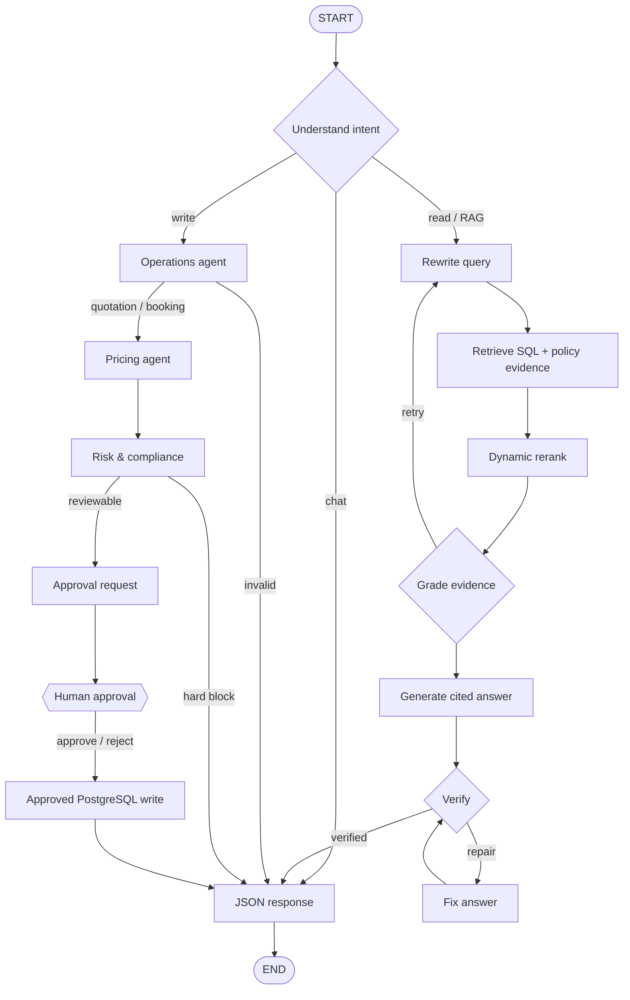

# Shipping Logistics Agent

Standalone learning project: prompt-driven shipping operations over an isolated
PostgreSQL `shipping` schema, exposed as MCP tools and orchestrated by a
LangGraph multi-agent workflow.

## Architecture



Agents:

- **Understand:** routes chat, authoritative read/RAG, and transactional write lanes.
- **Rewrite:** makes retrieval queries precise while preserving shipping identifiers.
- **Retrieve:** converts parameterized PostgreSQL results and policy rules into evidence.
- **Rerank/grade:** dynamically ranks top-k evidence and retries weak retrieval once.
- **Generate/verify/fix:** writes cited `[S#]` answers, rejects unsupported references,
  and allows one bounded repair loop.
- **Operations:** extracts validated identifiers and queries PostgreSQL.
- **Pricing:** calculates quotation or booking proposals.
- **Risk/compliance:** checks capacity, credit, validity, and dangerous goods.
- **Human approval:** graph pauses before every quotation/booking write.
- **Execution:** validates the persisted approval, then performs a parameterized write.
- **Response:** returns JSON with state, trace, pending approval, and graph topology.

There is no generic SQL MCP tool. Every query is fixed and parameterized.

## Sample schema

The migration creates:

- customers and credit status
- ports (UN/LOCODE)
- vessels and scheduled sailings
- quotations and bookings
- containers and shipment events
- approval requests and audit log

Sample routes include Nhava Sheva → Singapore, Nhava Sheva → Jebel Ali,
Singapore → Rotterdam, and Nhava Sheva → Rotterdam.

## Setup

From the repository root:

```bash
docker compose -f deploy/docker-compose.yml up -d db
python -m projects.shipping_logistics_agent.migrate
```

Explicit customer codes, UN/LOCODEs, container types, weights, and references use
fast deterministic extraction. Read requests use `qwen3:8b` for query rewriting
and grounded answer generation, then deterministic citation/reference verification.
Set `SHIPPING_USE_LLM_ANSWERS=false` for template-only responses.

## Run the JSON API

```bash
uvicorn projects.shipping_logistics_agent.api:app --reload --port 8010
```

Start the Angular UI in another terminal:

```bash
cd ui && npm start
```

Open <http://localhost:4200/shipping> and use the floating AI button. The drawer
includes suggested prompts, typing animation, timestamps, agent/tool chips, and
inline quotation/booking approval. Behind it, a live workflow dashboard explains
the read/write branches, run path, tool calls, checkpoint memory, thread ID, and
visited, waiting, or blocked graph nodes. Raw JSON remains available in its tab.

Endpoints:

- `GET /api/shipping/health`
- `POST /api/shipping/run`
- `POST /api/shipping/approve`
- `GET /api/shipping/approvals/{thread_id}`
- `GET /api/shipping/graph` — JSON topology + Mermaid
- `GET /api/shipping/graph/mermaid` — Mermaid text
- `GET /api/shipping/graph/view` — self-contained visual graph
- Swagger: <http://localhost:8010/docs>

### Read-only prompt

```bash
curl -X POST http://localhost:8010/api/shipping/run \
  -H 'Content-Type: application/json' \
  -d '{"prompt":"Find sailings from INNSA to SGSIN"}'
```

The chatbot also supports bounded analytical retrieval:

```text
How many confirmed bookings are there?
Summarize quotations by status for ACME-IN
List the latest 10 sailings from INNSA to SGSIN
Show me quotation SLQ-...
Give me an overview and counts of all shipping data
```

Supported datasets are customers, ports, vessels, sailings, quotations, bookings,
containers, and shipment events. Lists are capped at 25 records; filters and
counts use parameterized, allowlisted queries rather than generic SQL.

### Quotation with approval

```bash
curl -X POST http://localhost:8010/api/shipping/run \
  -H 'Content-Type: application/json' \
  -d '{
    "prompt":"Create quotation for ACME-IN from INNSA to SGSIN, 2x40HC, 18000kg electronics"
  }'
```

The response has `"interrupted": true` and a `thread_id`. Approve:

```bash
curl -X POST http://localhost:8010/api/shipping/approve \
  -H 'Content-Type: application/json' \
  -d '{
    "thread_id":"<thread-id>",
    "approve":true,
    "reviewer":"operations.manager@example.com",
    "note":"Rates and capacity checked"
  }'
```

Reject by sending `"approve": false`; no quotation/booking write occurs.

## CLI

```bash
python -m projects.shipping_logistics_agent run \
  "Find sailings from INNSA to SGSIN"

python -m projects.shipping_logistics_agent graph
```

HITL checkpoints are stored in `.data/shipping-checkpoints.db`, so a pending
thread can resume after an API restart. PostgreSQL remains the source of truth
for approval status and business records.

## MCP server

Run over stdio:

```bash
python -m projects.shipping_logistics_agent.mcp_server
```

Tools:

- `shipping_reference_data`
- `shipping_data_overview`
- `shipping_policy_knowledge` (ranked business-rule evidence)
- `query_shipping_data` (safe count, status summary, and bounded list)
- `search_sailings`
- `calculate_quotation` (proposal only)
- `get_quotation`
- `track_booking`
- `execute_human_approved_action` (requires approved thread)

Example MCP client configuration:

```json
{
  "mcpServers": {
    "shipping-postgres": {
      "command": "/absolute/path/to/.venv/bin/python",
      "args": [
        "-m",
        "projects.shipping_logistics_agent.mcp_server"
      ],
      "cwd": "/absolute/path/to/Learning- LangGraph"
    }
  }
}
```

## Safety boundary

- isolated PostgreSQL schema
- fixed allowlisted tools; no prompt-to-SQL execution
- parameterized queries and bounded result limits
- hard blocks for capacity, invalid quotation, and disallowed dangerous goods
- persisted human decision before business writes
- execution re-checks approval and current capacity
- audit record for every executed mutation

